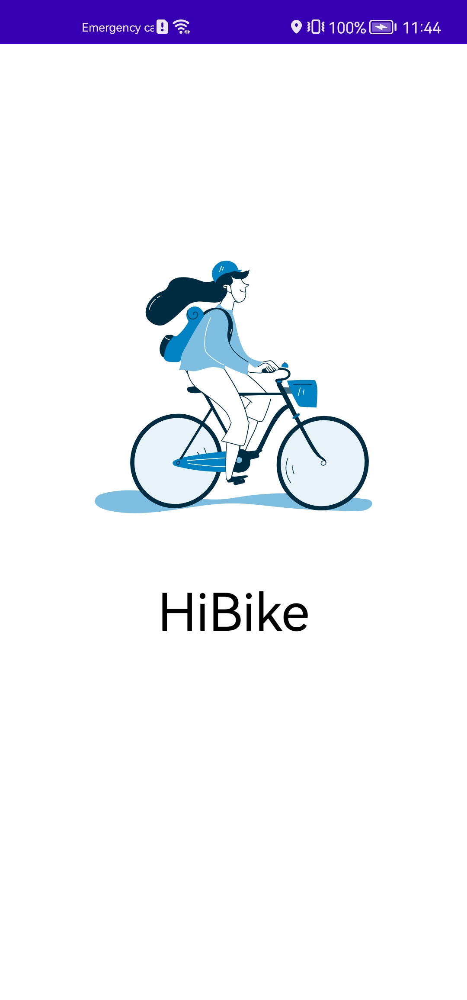
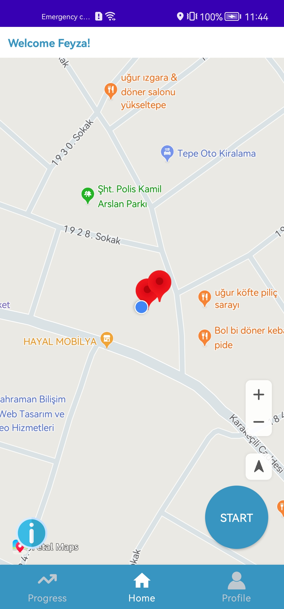
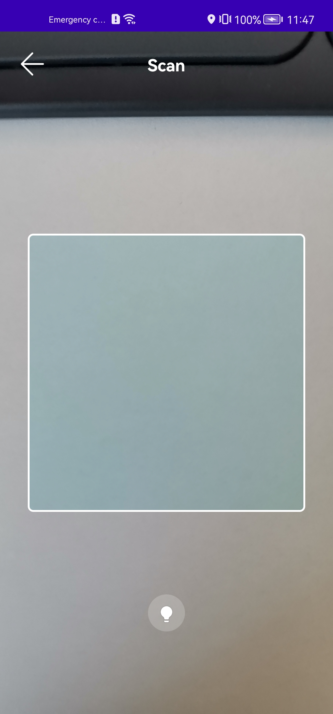
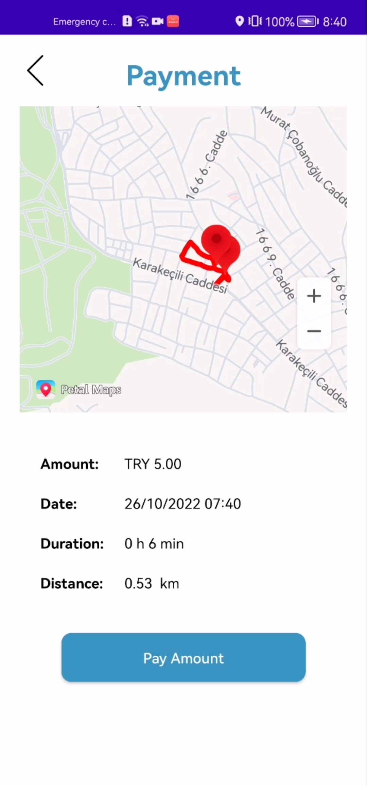
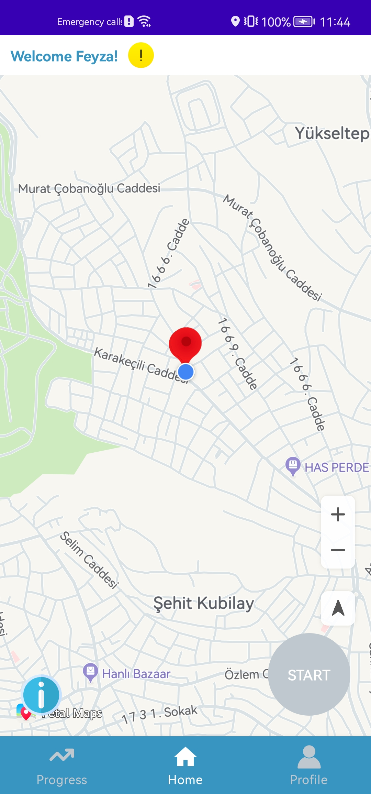
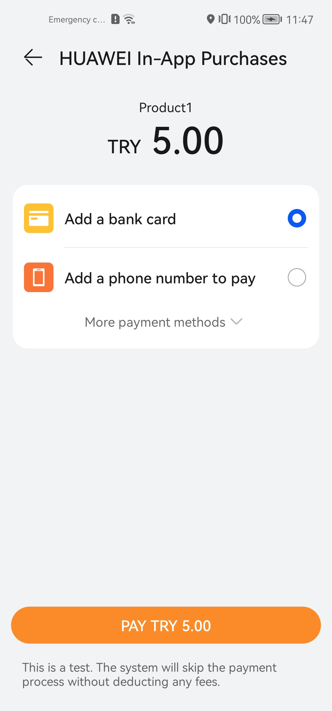
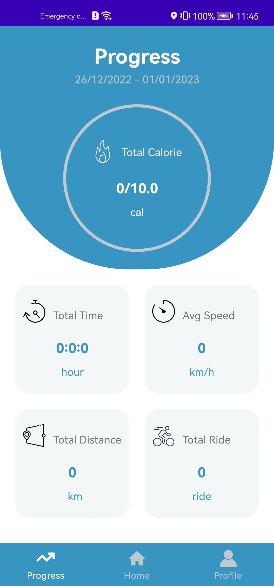

# Healthy Cycling

## Introduction

Healthy Cycling is the mix of bike rental and exercise application which you can perform bike rental operations and see your weekly progress with some data like total distance, calorie.
The user displays the available bicycles on the map and can initiate rental by scanning QR code. If the user visits an area that we have determined with the Geofence feature while riding a bicycle, he/she will receive a surprise discount for the next ride and will be informed via App Messaging. When the user completes his/her riding with the location listening process, which is completely in the background, he/she can pay the fee determined according to the time and see the route he/she is traveling on the map. At the same time, this ride is recorded in the Huawei Health Application as an exercise with the Health Kit. Also, the user can track the total calories, total distance, duration, number of rides and average speed data in the weekly progress page of the application.

## Outputs

|  |  |  |  |
| --- | --- | --- | --- |
|  |  |  |  |

## What You Will Need

**Hardware Requirements**
- A computer that can run Android Studio.
- A Huawei Phone for debugging.
- Works on devices with HMS.

**Software Requirements**
- Android SDK package
- Android Studio 3.6.1 or later
- HUAWEI HMS Core 5.0.4.300 or later
- JDK version: 1.8 or later

## Preparations

Preparations required to run the application.

### Create a Project and App in AppGalleryConnect
https://developer.huawei.com/consumer/en/codelab/HMSPreparation/index.html#0

### Configuring the Signing Certificate Fingerprint in AppGallery Connect
https://developer.huawei.com/consumer/en/codelab/HMSPreparation/index.html#4

### Enable HUAWEI Service(s) in AGC console
https://developer.huawei.com/consumer/en/codelab/HMSPreparation/index.html#5

Enable the API permission for below kits from Project Settings, Manage APIs and enable the API permission.
- Map Kit
- Location Kit
- Scan Kit
- IAP
- Push Kit

**Note:** Some API’s will be enabled by default. If not enable it manually.

### Enable Huawei Auth Service
https://developer.huawei.com/consumer/en/doc/development/AppGallery-connect-Guides/agc-auth-enable-service-0000001274125746

* Sign in to AppGallery Connect and click My projects. Find and click your project.
* Go to Build > Auth Service and click Enable now.

### Applying for the Health Kit Service
https://developer.huawei.com/consumer/en/doc/development/HMSCore-Guides/apply-kitservice-0000001050071707

* Sign in to Console, click Health Kit. Click Apply for Health Kit to enable it for the application.

### Enable App Messaging Service
https://developer.huawei.com/consumer/en/doc/development/AppGallery-connect-Guides/agc-appmessaging-enableservice-0000001322456700

* Sign in to AppGallery Connect and click My projects. Find and click your project.
* Go to Grow > App Messaging and click Enable now.

### Adding the AppGallery Connect Configuration File of Your App
https://developer.huawei.com/consumer/en/codelab/HMSPreparation/index.html#6

* Sign in to AppGallery Connect, go to Project settings > General information. In the App information area, download the agconnect-services.json file.
* Copy the agconnect-services.json file to the app's root directory.

## Project Structure & Libraries

Healthy Cycling App is designed with MVVM design pattern.

- Huawei Auth Service
- Map Kit
- Location Kit
- Scan Kit
- IAP
- Push Kit
- Health Kit
- App Messaging
- Kotlin
- Dependency Injection - Hilt
- Coroutines
- Lifecycle
- View Binding
- State Flow
- Service
- Navigation Component
- Lottie Animation
- Glide

## Contributors

- Mehmet Yozgatli
- Feyza Urkut

## License
HMS Guide sample is licensed under the [Apache License, version 2.0](http://www.apache.org/licenses/LICENSE-2.0).

