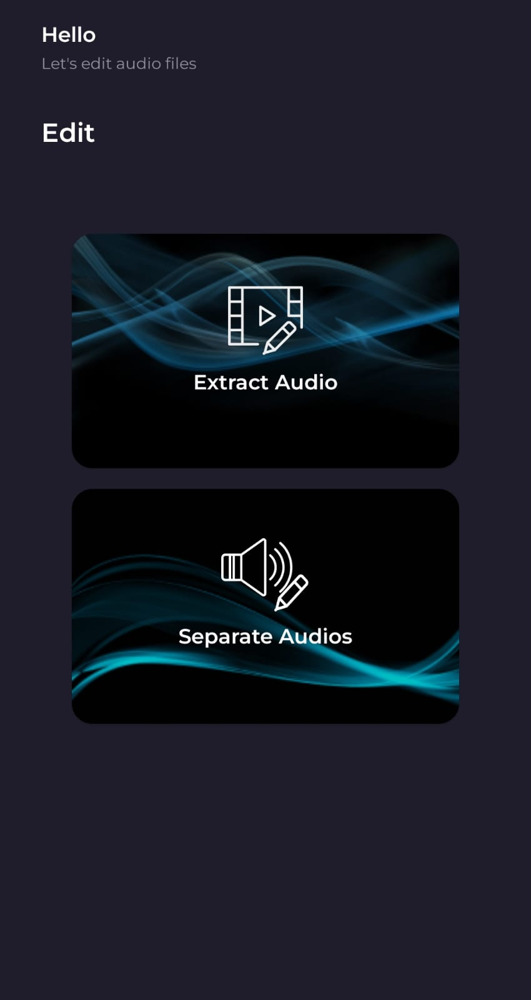
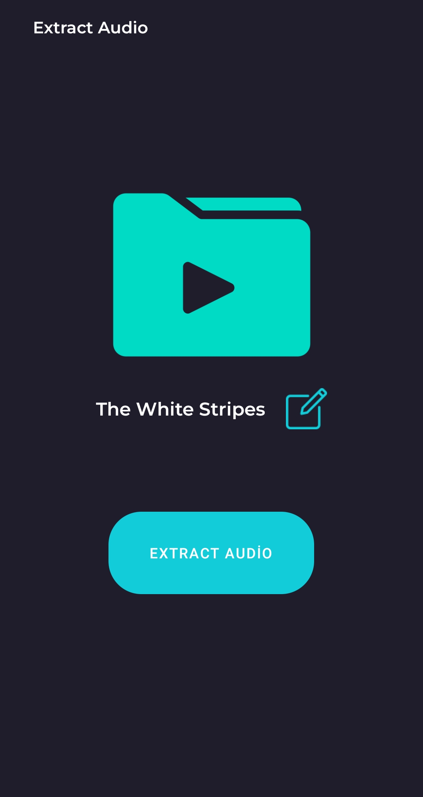
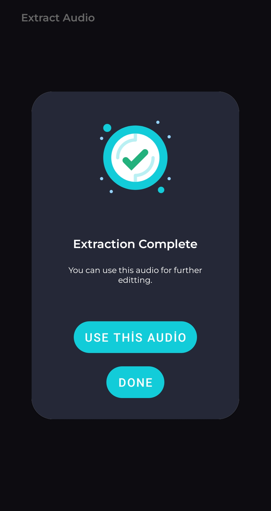
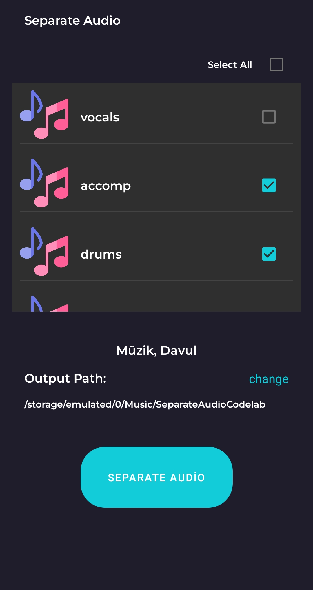
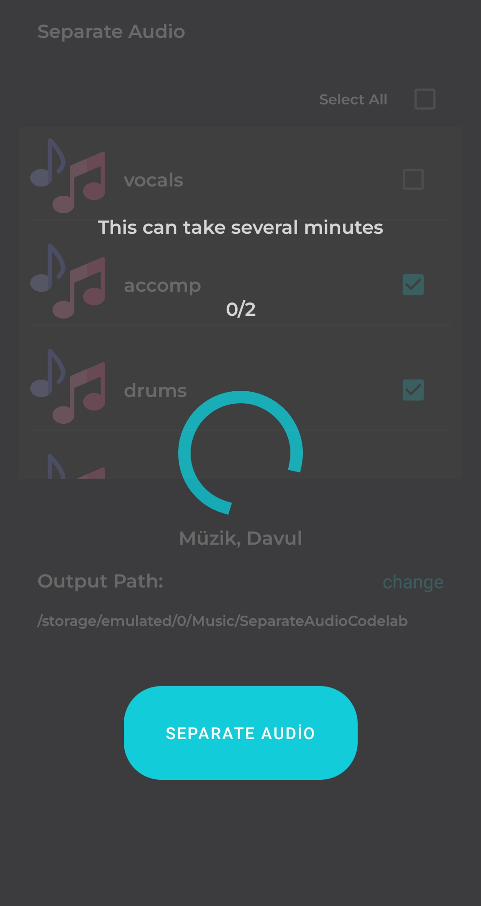
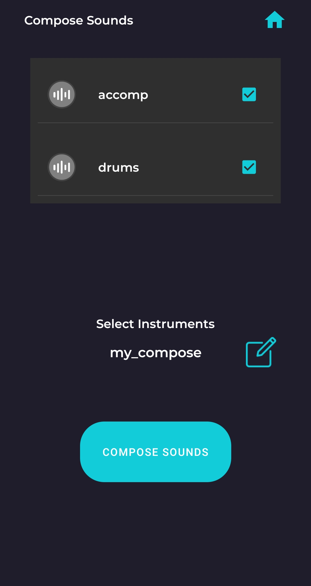

# Separate & Compose Audios

   

In this project you can extract the audio from the video, split the music into its components and combine these components to create new audio files.
You can extract following instruments from music:
1. Vocals
2. Music
3. Drums
4. Guitar
5. Bass Guitar
6. Violin
7. Piano

## Introduction

Features:
1.	Extract audio from video.
2.	Separate instruments from audio file.
3.	Compose separated instruments and create new audio file.

## About HUAWEI Audio Editor Kit

Audio Editor Kit provides a wide range of audio editing capabilities, including AI dubbing, audio source separation, spatial audio, voice changer, and sound effects.

For more information -> [Huawei Audio Editor Kit Guide](https://developer.huawei.com/consumer/en/doc/development/Media-Guides/introduction-0000001153026881)

## What You Will Need

**Hardware Requirements**
- A computer that can run Android Studio.
- Huawei mobile device with a USB data cable for running developed apps

**Software Requirements**
- Java JDK 1.8 or later
- Android Studio 2021.2.x
- Android SDK package
- Android API Level 21 or higher
- HMS Core (APK) 5.0.0.300 or later
- EMUI 8.0 or later

## Getting Started

This project uses HUAWEI services. To use them, you have to [create an app](https://developer.huawei.com/consumer/en/doc/distribution/app/agc-create_app) first. Before getting started, please [sign-up](https://id1.cloud.huawei.com/CAS/portal/userRegister/regbyemail.html?service=https%3A%2F%2Foauth-login1.cloud.huawei.com%2Foauth2%2Fv2%2Flogin%3Faccess_type%3Doffline%26client_id%3D6099200%26display%3Dpage%26flowID%3D6d751ab7-28c0-403c-a7a8-6fc07681a45d%26h%3D1603370512.3540%26lang%3Den-us%26redirect_uri%3Dhttps%253A%252F%252Fdeveloper.huawei.com%252Fconsumer%252Fen%252Flogin%252Fhtml%252FhandleLogin.html%26response_type%3Dcode%26scope%3Dopenid%2Bhttps%253A%252F%252Fwww.huawei.com%252Fauth%252Faccount%252Fcountry%2Bhttps%253A%252F%252Fwww.huawei.com%252Fauth%252Faccount%252Fbase.profile%26v%3D9f7b3af3ae56ae58c5cb23a5c1ff5af7d91720cea9a897be58cff23593e8c1ed&loginUrl=https%3A%2F%2Fid1.cloud.huawei.com%3A443%2FCAS%2Fportal%2FloginAuth.html&clientID=6099200&lang=en-us&display=page&loginChannel=89000060&reqClientType=89) for a HUAWEI developer account.

After creating the application, you need to [generate a signing certificate fingerprint](https://developer.huawei.com/consumer/en/codelab/HMSPreparation/index.html#3). Then you have to set this fingerprint to the application you created in AppGallery Connect.
- Go to "My Projects" in AppGallery Connect.
- Find your project from the project list and click the app on the project card.
- On the Project Setting page, set SHA-256 certificate fingerprint to the SHA-256 fingerprint you've generated.


## Using the Application

Upon completing the essential parts of the code, connect your mobile device to the PC and enable the USB debugging mode. In the Android Studio window, click the icon to run the project you have created in Android Studio to generate an APK. Then install the APK on the mobile device.

1.  Before you run the app, make sure that you have a working internet connection.
2.	Then, open the app upon installing it on your device.
3.  On first page you will see two buttons direct you to audio extraction and sound separation pages.
4.	When you click extract audio you will se extraction page. In this page you can choose videos from your phone and its after extraction name.
5.	After extraction you will see a pop-up screen asks you want to use extracted audio to in separation page. You can use audio file you extracted from video or you can use another audio from your device.
6.  After you reach the separation page you will see list of instruments. You can choose which one of thoose instruments you want to separate from audio file. You can select more than one and you can select all. Also you can change destination folder to save separated audio files. Separation progress can take several minutes.
7.  When separation is done you will be taken to composing page. In this page you will see instruments in a list you chosed on previous page.
8.  You can click sound icons to listen separated instruments.
9.	In this page you can select insturments to compose them and you can specify file name after composition.
10.	New audio file will be created with selected instruments when you clicked to compose button.

## Screenshots

<table>
<tr>
<td>
 
</td>
<td>
 
</td>
<td>

</td>
</tr>

<tr>
<td>

</td>
<td>

</td>
<td>
 
</td>
</tr>
</table>

## Project Structure

This project is designed with MVVM design pattern.

## Libraries
- Huawei Audio Editor Kit
- Kotlin Coroutines
- Navigation
- Sonarqube

# License
```xml

 Copyright 2022. Explore in HMS. All rights reserved.

 Licensed under the Apache License, Version 2.0 (the "License");
 you may not use this file except in compliance with the License.
 You may obtain a copy of the License at

 http://www.apache.org/licenses/LICENSE-2.0

 Unless required by applicable law or agreed to in writing, software
 distributed under the License is distributed on an "AS IS" BASIS,
 WITHOUT WARRANTIES OR CONDITIONS OF ANY KIND, either express or implied.
 See the License for the specific language governing permissions and
 limitations under the License.

```
